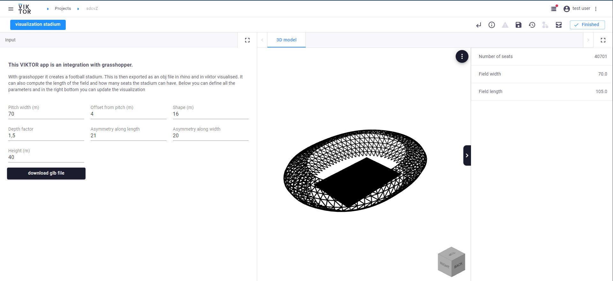

 <Please check version is the same as specified in requirements.txt>

# Sample app parametric football stadium with Grasshopper
Use this open-source sample application to parametrically design a football stadium through an 
integration with grasshopper, without opening the grasshopper interface at all. 
The sample app provides a clear visualization of the stadium, and calculates the maximum number of seats. 
You can then also download the model as a gtb file

## Setting up:
When using this app with VIKTOR there are a few steps required to make this app work.
1. Make sure you have Rhino installed at ``C:\Program Files\Rhino 7\System\Rhino.exe`` or change the path in [app/grasshopper/data/run_grasshopper.bat](app/grasshopper/data/run_grasshopper.bat)
2. Install a generic worker found on https://docs.viktor.ai/docs/worker. Make sure you select ``generic``
3. Copy the file found at [app/grasshopper/data/run_grasshopper.bat](app/grasshopper/data/run_grasshopper.bat) in the same worker folder.
4. Replace the config.yaml file in your worker folder with the file found at [app/grasshopper/data/config.yaml](app/grasshopper/data/config.yaml)
5. Execute the ``viktor-worker-generic.exe`` file with admin rights

**Apply for a [demo account](https://www.viktor.ai/demo-environment) to get access to this and all other VIKTOR sample applications.**

In this picture you can see how the app should look like. With on the left all the input parameters and the download button. In the middle there is a 3d view of the mesh. And on the right you can find all the info.

Use the [free version](https://www.viktor.ai/try-for-free) or apply for a [demo account](https://www.viktor.ai/try-for-free) to try the functionality yourself! 
